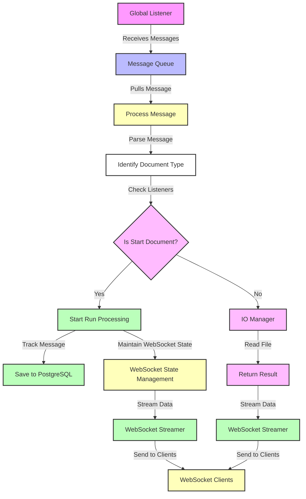

[](https://github.com/stan-dot/websockets-plotting-blue/actions/workflows/ci.yml)
[](https://codecov.io/gh/stan-dot/websockets-plotting-blue)
[](https://pypi.org/project/websockets-plotting-blue)
[](https://opensource.org/licenses/Apache-2.0)

# websockets_plotting_blue

plotting bluesky scans with websockets for frontend consumption

This is where you should write a short paragraph that describes what your module does,
how it does it, and why people should use it.

|  Source  |     <https://github.com/stan-dot/websockets-plotting-blue>      |
| :------: | :-------------------------------------------------------------: |
|   PyPI   |             `pip install websockets-plotting-blue`              |
|  Docker  |  `docker run ghcr.io/stan-dot/websockets-plotting-blue:latest`  |
| Releases | <https://github.com/stan-dot/websockets-plotting-blue/releases> |

This is where you should put some images or code snippets that illustrate
some relevant examples. If it is a library then you might put some
introductory code here:

```python
from websockets_plotting_blue import __version__

print(f"Hello websockets_plotting_blue {__version__}")
```

Or if it is a commandline tool then you might put some example commands here:

```
python -m websockets_plotting_blue --version
```

# use

- [ ] the parsing should rely on processing based on the start-document ID, defined in the plan
- [ ] specific raster scan processing reconstruction logic gets StreamResource and a bunch of file system images
- [ ] from the images the data representation is constructed - ? what is the data format here?

need to go through the tutorials
need windowing to collect the data - a set of images
<https://docs.bytewax.io/stable/guide/getting-started/collecting-windowing-example.html>


